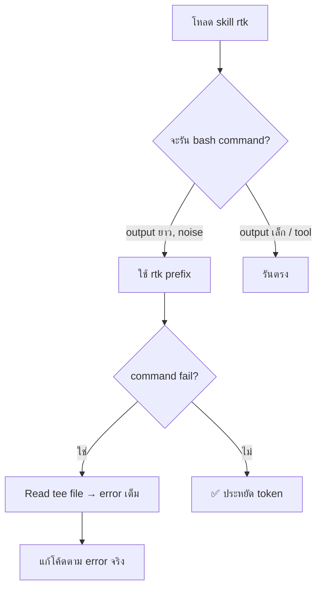

# Token Saver ⚡ — RTK Protocol

> **AI Agent Protocol:** ทุก agent ต้องโหลด skill นี้ (`skill("rtk")`) **ก่อนรัน bash command ใดๆ** ใน session นี้
> บนเครื่อง Mike ติดตั้ง OpenCode plugin auto-rewrite ไว้แล้วที่ `C:\Users\Gigabyte\.config\opencode\plugins\rtk.ts`

RTK (Rust Token Killer) = CLI proxy ที่กรอง output bash command ก่อนถึง LLM context
**ประหยัด 55-90%** ของ tokens ที่เสียไปกับ progress bar, passed test boilerplate, file list

## กติกาเหล็ก (Iron Rules)

### ✅ ใช้ `rtk` เสมอ — คำสั่งพวกนี้ output ยาว = noise

| คำสั่ง | ให้ใช้ | เพราะ |
|-------|-------|-------|
| `git status`, `git log`, `git diff`, `git add`, `git commit`, `git push` | `rtk git ...` | compress 53-96% |
| `pytest`, `cargo test`, `go test`, `jest`, `vitest` | `rtk pytest`, `rtk cargo test` | เอาแค่ passed/failed, strip boilerplate |
| `npm install`, `pnpm install`, `pip install`, `uv pip install` | `rtk npm/pnpm/pip install` | progress bar = garbage |
| `find ...` | `rtk find ...` | tree output แทน flat list |
| `docker ps`, `docker images`, `docker build` | `rtk docker ...` | strip SHA/IDs |
| `curl ...` | `rtk curl ...` | auto JSON → schema |
| `json file.json` | `rtk json ...` | compact / keys-only |
| `tsc --noEmit`, `tsc` | `rtk tsc` | error output ใหญ่ (แต่ถ้า fail → tee recovery) |

### ❌ ไม่ต้องใช้ rtk — output เล็กหรือใช้ tool พิเศษ

| คำสั่ง | เพราะ |
|-------|-------|
| `echo`, `Write-Output`, `which`, `Test-Path` | output = 1-2 tokens |
| `mkdir`, `New-Item`, `Remove-Item` | output = nothing |
| `Read` tool, `Glob` tool, `Grep` tool | ไม่ใช่ bash — ใช้ tool ของ OpenCode |
| `git diff` **ตอนต้อง review code จริง** | ต้องเห็น diff เต็ม ไม่ใช่แค่ changed lines |

### 🚨 ทางเลือกเมื่อต้องการ output ดิบ

ใช้ `rtk proxy <cmd>` แทน — RTK จะไม่ filter แต่ยัง track token savings

---

## ⚡ Tee Recovery Protocol (สำคัญที่สุด)

นี่คือหัวใจของระบบ — เวลาใช้ RTK แล้ว **command fail**:

**Flow:**
```
1. รัน: rtk tsc --noEmit
2. output: FAILED: 3 errors  [full output: C:\Users\Gigabyte\AppData\Local\rtk\tee\xxx.log]
3. AI ต้อง: Read ไฟล์นั้น → ดู error จริง → แก้โค้ด
4. ห้าม: เดา error, ignore tee file, หรือถาม Mike ซ้ำ
```

**tee file paths ตาม OS:**
| OS | Path |
|----|------|
| Windows | `C:\Users\<user>\AppData\Local\rtk\tee\` |
| Linux/Mac | `~/.local/share/rtk/tee/` |

**Config ที่เครื่อง Mike:**
```toml
[tee]
enabled = true
mode = "failures"    # save output เต็มเมื่อ command fail
max_files = 20
max_file_size = 1048576
```

**ทุกคำสั่งที่ filter แล้ว fail → recovery protocol นี้บังคับใช้**
คือ: `rtk tsc`, `rtk pytest`, `rtk cargo test`, `rtk go test`, `rtk jest` ที่ fail

---

## Agent Workflow (ครบจบในขั้นตอนเดียว)



**ก่อนรันอะไรก็ตาม ถามตัวเอง:**
1. output นี้ noise หรือ data? → noise = rtk, data = ตรงหรือ `rtk proxy`
2. ถ้า rtk แล้ว fail → tee recovery
3. อย่าส่ง tee output เข้า context โดยไม่จำเป็น — แค่อ่านแล้วใช้ความรู้

---

## Prerequisites

```bash
rtk --version   # v0.34.3+ (v0.34.x = latest ที่เครื่อง Mike)
rtk gain        # ดู token savings สะสม
```

บนเครื่อง Mike: ติดตั้งแล้ว — OpenCode plugin auto-rewrite ที่ `C:\Users\Gigabyte\.config\opencode\plugins\rtk.ts`

## Analytics

```bash
rtk gain              # summary
rtk gain --history    # recent commands
rtk gain --daily      # day-by-day
```

## Trouble

| ปัญหา | วิธีแก้ |
|-------|--------|
| plugin auto-rewrite ไม่ทำงาน | restart OpenCode, เช็ค `Test-Path "C:\Users\Gigabyte\.config\opencode\plugins\rtk.ts"` |
| rtk หา tee file ไม่เจอ | ใช้ `rtk proxy <cmd>` แทน หรือรัน command ตรง |
| คำสั่งไหน filter แล้ว output หาย | ส่ง `--verbose` flag ให้ rtk หรือใช้ `rtk proxy` |

---

> **Bottom line:** RTK เปลืองพื้นที่ตรงไหนที่มันควรเปลือง (fail = error เต็มผ่าน tee)
> และประหยัดตรงที่มันควรประหยัด (pass = รู้แค่ว่าผ่าน)
> Agent ที่ดี = ใช้ rtk, recover from tee, ไม่เดา error
